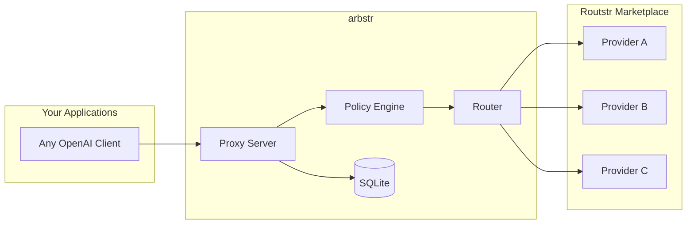
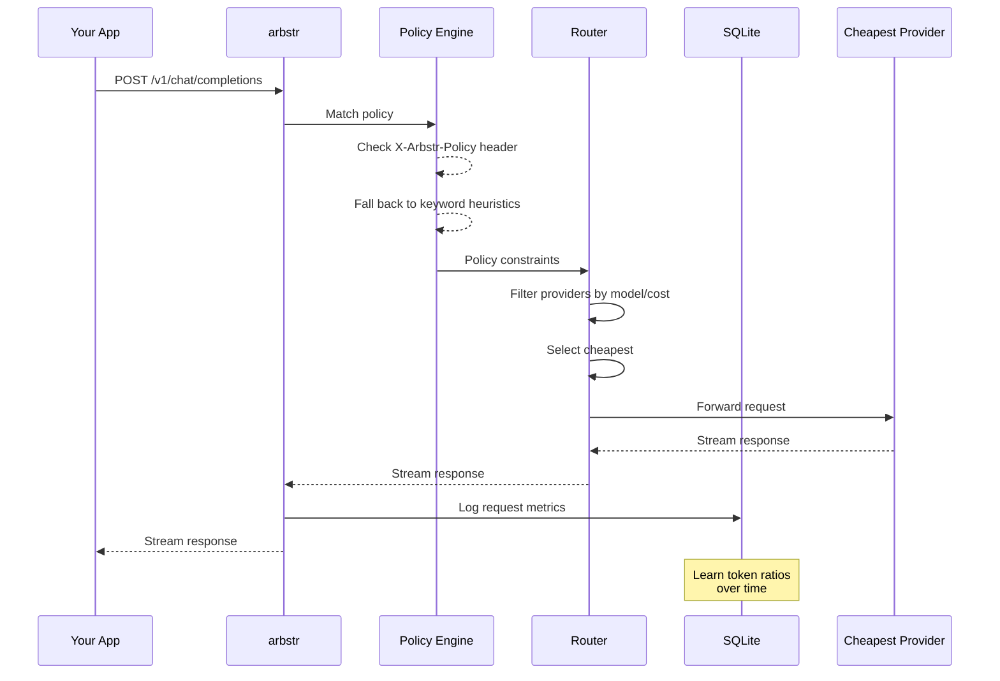

# CLAUDE.md - Development Guide for arbstr

## Project Overview

arbstr is an intelligent LLM routing and cost optimization layer for the Routstr decentralized marketplace. It acts as a local proxy between your applications and Routstr providers, selecting the optimal provider based on cost, policies, and constraints.

## Quick Reference

```bash
# Build
cargo build --release

# Run tests
cargo test

# Run with mock providers (no real API calls)
cargo run -- serve --mock

# Run with config file
cargo run -- serve -c config.toml

# Run with debug logging
RUST_LOG=arbstr=debug cargo run -- serve --mock

# Validate config
cargo run -- check -c config.toml

# List providers
cargo run -- providers -c config.toml

# Format code
cargo fmt

# Lint
cargo clippy -- -D warnings
```

## Architecture



### Request Flow



### Key Components

- **Proxy Server** (`src/proxy/`): OpenAI-compatible HTTP server using axum, retry with backoff and provider fallback, SSE stream interception for usage extraction
- **Router** (`src/router/`): Provider selection logic, cost optimization
- **Config** (`src/config.rs`): TOML configuration parsing, env var expansion, SecretString key management
- **Storage** (`src/storage/`): SQLite request logging with async fire-and-forget writes, read-only analytics pool for stats/logs queries
- **Error** (`src/error.rs`): Error types with OpenAI-compatible responses

**Planned:**
- **Policy Engine** (`src/policy/`): Advanced constraint matching (currently in router)

## Tech Stack

- **Runtime**: Tokio async
- **HTTP Server**: axum
- **HTTP Client**: reqwest
- **Database**: SQLite via sqlx (embedded migrations)
- **Serialization**: serde + serde_json
- **CLI**: clap
- **Config**: toml
- **Secrets**: secrecy (SecretString with zeroize-on-drop)
- **Logging**: tracing + tracing-subscriber
- **Streaming**: tokio-stream (ReceiverStream for channel-based bodies), bytes

## Code Conventions

- Use `thiserror` for error types
- Async everywhere (no blocking in async context)
- Prefer `impl Trait` over `Box<dyn Trait>` when possible
- All public APIs should have doc comments
- Integration tests in `tests/`, unit tests in modules

## Configuration

Config file: `config.toml` (see `config.example.toml` for full example)

```toml
[server]
listen = "127.0.0.1:8080"

[database]
path = "./arbstr.db"

# Provider configuration (rates in sats per 1000 tokens)
[[providers]]
name = "provider-alpha"
url = "https://api.routstr.com/v1"
api_key = "${ALPHA_KEY}"  # env var reference (recommended)
models = ["gpt-4o", "claude-3.5-sonnet"]
input_rate = 10
output_rate = 30
base_fee = 1

[[providers]]
name = "provider-beta"
url = "https://other-provider.com/v1"
# api_key omitted -- arbstr auto-checks ARBSTR_PROVIDER_BETA_API_KEY
models = ["gpt-4o", "gpt-4o-mini"]
input_rate = 8
output_rate = 35

[policies]
default_strategy = "cheapest"

[[policies.rules]]
name = "code_generation"
allowed_models = ["claude-3.5-sonnet", "gpt-4o"]
strategy = "lowest_cost"
max_sats_per_1k_output = 50
keywords = ["code", "function", "implement"]
```

### API Key Management

Three ways to provide API keys (most to least recommended):

1. **Convention-based** -- omit `api_key`, set `ARBSTR_<UPPER_SNAKE_NAME>_API_KEY` env var
2. **Environment variable reference** -- `api_key = "${MY_KEY}"` in config
3. **Literal** (not recommended) -- plaintext in config; triggers startup warning

## Database Schema (SQLite)

Schema applied via embedded migrations (`migrations/`).

```sql
-- Request log for cost tracking and observability
CREATE TABLE requests (
    id INTEGER PRIMARY KEY AUTOINCREMENT,
    correlation_id TEXT NOT NULL,
    timestamp TEXT NOT NULL,
    model TEXT NOT NULL,
    provider TEXT,
    policy TEXT,
    streaming BOOLEAN NOT NULL DEFAULT FALSE,
    input_tokens INTEGER,
    output_tokens INTEGER,
    cost_sats REAL,
    provider_cost_sats REAL,
    latency_ms INTEGER NOT NULL,
    stream_duration_ms INTEGER,        -- full stream duration (NULL for non-streaming)
    success BOOLEAN NOT NULL,
    error_status INTEGER,
    error_message TEXT
);

-- Learned input/output ratios per policy (populated in future phases)
CREATE TABLE token_ratios (
    policy TEXT PRIMARY KEY,
    avg_ratio REAL NOT NULL,
    sample_count INTEGER NOT NULL DEFAULT 0
);
```

## Testing Strategy

- **Unit tests**: Mock providers, test routing logic in isolation
- **Integration tests**: Spin up test server, make real HTTP calls
- **Mock mode**: `--mock` flag to use fake providers with configurable delays/costs
- **Future**: Bitcoin testnet/signet for payment testing

## Shipped Versions

- **v1** -- Reliability and observability: retry with backoff and fallback, SQLite request logging, response metadata headers, corrected cost calculation
- **v1.1** -- Secrets hardening: SecretString API keys with zeroize-on-drop, `${VAR}` env var expansion, convention-based key auto-discovery, file permission warnings, masked key prefixes, literal key warnings
- **v1.2** -- Streaming observability: `stream_options` injection for usage data, SSE line-buffered parser with cross-chunk reassembly, `wrap_sse_stream` with panic isolation, channel-based streaming handler, trailing SSE event with cost/latency metadata, post-stream DB UPDATE for tokens/cost/duration/status
- **v1.3** -- Cost querying API: GET /v1/stats with aggregate queries and per-model breakdown, GET /v1/requests with paginated log listing, read-only SQLite pool, time range presets and ISO 8601 filtering, model/provider filtering, sort column whitelist for SQL injection prevention, nested response structure (tokens/cost/timing/error)

## Key Files

```
src/
├── main.rs           # CLI entry point (serve, check, providers commands)
├── lib.rs            # Library root, re-exports
├── config.rs         # Config parsing, env var expansion, ApiKey/SecretString
├── error.rs          # Error types with OpenAI-compatible responses
├── proxy/
│   ├── mod.rs
│   ├── server.rs     # axum server setup, AppState
│   ├── handlers.rs   # /v1/chat/completions, /v1/models, /health, /providers
│   ├── retry.rs      # Retry with exponential backoff and provider fallback
│   ├── stream.rs     # SSE observer, wrap_sse_stream, StreamResultHandle
│   ├── stats.rs      # /v1/stats handler, time range resolution, StatsQuery/StatsResponse
│   ├── logs.rs       # /v1/requests handler, pagination, LogsQuery/LogsResponse/LogEntry
│   └── types.rs      # OpenAI-compatible request/response types
├── router/
│   ├── mod.rs
│   └── selector.rs   # Provider selection (cheapest, policy constraints)
└── storage/
    ├── mod.rs
    ├── logging.rs    # Async fire-and-forget SQLite request logging
    ├── stats.rs      # Aggregate stats queries, exists_in_db validation, read-only pool init
    └── logs.rs       # Paginated log queries (count_logs, query_logs) with dynamic WHERE/ORDER BY
tests/
├── env_expansion.rs  # Integration tests for env var expansion and key discovery
├── stream_options.rs # Integration tests for stream_options injection
├── stats.rs          # Integration tests for /v1/stats endpoint (14 tests)
└── logs.rs           # Integration tests for /v1/requests endpoint (20 tests)
migrations/
└── *.sql             # Embedded SQLite schema migrations
```

## Environment Variables

- `RUST_LOG`: Log level (e.g., `arbstr=debug,tower_http=trace`)
- `ARBSTR_CONFIG`: Path to config file (default: `./config.toml`)
- `DATABASE_URL`: SQLite path (default: `./arbstr.db`)
- `ARBSTR_<UPPER_SNAKE_NAME>_API_KEY`: Convention-based API key per provider (e.g., `ARBSTR_PROVIDER_ALPHA_API_KEY`)

## Notes for Claude

- This is an early-stage project, prioritize working code over perfection
- When adding providers, implement the `Provider` trait
- Cost calculations use satoshis (sats) as the unit
- OpenAI API compatibility is critical - test against real clients
- The policy engine should be easily extensible for future ML-based classification
