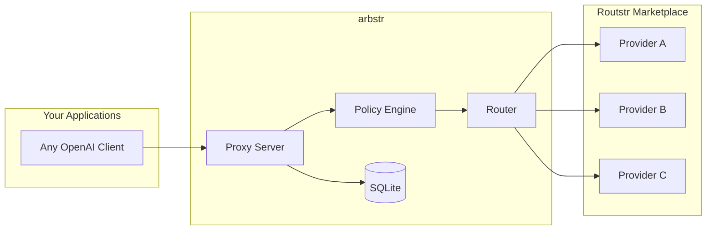
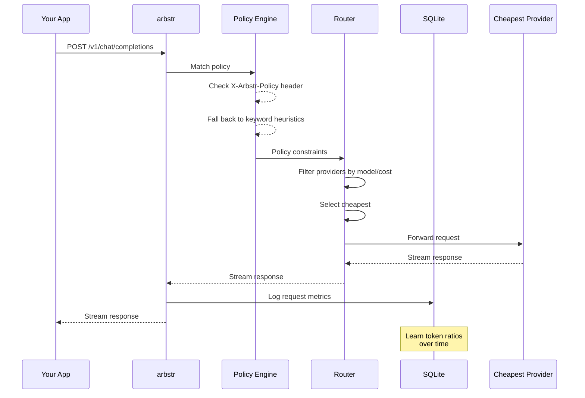

# CLAUDE.md - Development Guide for arbstr

## Project Overview

arbstr is an intelligent LLM routing and cost optimization layer for the Routstr decentralized marketplace. It acts as a local proxy between your applications and Routstr providers, selecting the optimal provider based on cost, policies, and constraints.

## Quick Reference

```bash
# Build
cargo build --release

# Run tests
cargo test

# Run with mock providers (no real API calls)
cargo run -- serve --mock

# Run with config file
cargo run -- serve -c config.toml

# Run with debug logging
RUST_LOG=arbstr=debug cargo run -- serve --mock

# Validate config
cargo run -- check -c config.toml

# List providers
cargo run -- providers -c config.toml

# Format code
cargo fmt

# Lint
cargo clippy -- -D warnings
```

## Architecture



### Request Flow



### Key Components

- **Proxy Server** (`src/proxy/`): OpenAI-compatible HTTP server using axum
- **Router** (`src/router/`): Provider selection logic, cost optimization
- **Config** (`src/config.rs`): TOML configuration parsing
- **Error** (`src/error.rs`): Error types with OpenAI-compatible responses

**Planned (not yet implemented):**
- **Storage** (`src/storage/`): SQLite for logging, costs, learned patterns
- **Policy Engine** (`src/policy/`): Advanced constraint matching (currently in router)

## Tech Stack

- **Runtime**: Tokio async
- **HTTP Server**: axum
- **HTTP Client**: reqwest
- **Database**: SQLite via sqlx
- **Serialization**: serde + serde_json
- **CLI**: clap
- **Config**: toml + config crate
- **Logging**: tracing + tracing-subscriber

## Code Conventions

- Use `thiserror` for error types
- Async everywhere (no blocking in async context)
- Prefer `impl Trait` over `Box<dyn Trait>` when possible
- All public APIs should have doc comments
- Integration tests in `tests/`, unit tests in modules

## Configuration

Config file: `config.toml` (see `config.example.toml` for full example)

```toml
[server]
listen = "127.0.0.1:8080"

[database]
path = "./arbstr.db"

# Provider configuration (rates in sats per 1000 tokens)
[[providers]]
name = "provider-alpha"
url = "https://api.routstr.com/v1"
api_key = "cashuA..."  # Cashu token
models = ["gpt-4o", "claude-3.5-sonnet"]
input_rate = 10
output_rate = 30
base_fee = 1

[[providers]]
name = "provider-beta"
url = "https://other-provider.com/v1"
models = ["gpt-4o", "gpt-4o-mini"]
input_rate = 8
output_rate = 35

[policies]
default_strategy = "cheapest"

[[policies.rules]]
name = "code_generation"
allowed_models = ["claude-3.5-sonnet", "gpt-4o"]
strategy = "lowest_cost"
max_sats_per_1k_output = 50
keywords = ["code", "function", "implement"]
```

## Database Schema (SQLite)

```sql
-- Request log for cost tracking and learning
CREATE TABLE requests (
    id INTEGER PRIMARY KEY,
    timestamp TEXT NOT NULL,
    policy TEXT,
    model TEXT NOT NULL,
    provider TEXT NOT NULL,
    input_tokens INTEGER,
    output_tokens INTEGER,
    cost_sats INTEGER,
    latency_ms INTEGER,
    success BOOLEAN
);

-- Learned input/output ratios per policy
CREATE TABLE token_ratios (
    policy TEXT PRIMARY KEY,
    avg_ratio REAL,
    sample_count INTEGER
);
```

## Testing Strategy

- **Unit tests**: Mock providers, test routing logic in isolation
- **Integration tests**: Spin up test server, make real HTTP calls
- **Mock mode**: `--mock` flag to use fake providers with configurable delays/costs
- **Future**: Bitcoin testnet/signet for payment testing

## MVP Milestones

1. **M1**: Basic proxy pass-through to single hardcoded provider ✅
2. **M2**: Multiple providers, cheapest selection based on advertised rates ✅
3. **M3**: Policy constraints (allowed models, max cost per request) ✅
4. **M4**: Request logging and cost tracking dashboard
5. **M5**: Heuristic-based automatic policy classification ✅ (basic keyword matching)

## Key Files

```
src/
├── main.rs           # CLI entry point (serve, check, providers commands)
├── lib.rs            # Library root, re-exports
├── config.rs         # Configuration parsing from TOML
├── error.rs          # Error types with OpenAI-compatible responses
├── proxy/
│   ├── mod.rs
│   ├── server.rs     # axum server setup, AppState
│   ├── handlers.rs   # /v1/chat/completions, /v1/models, /health, /providers
│   └── types.rs      # OpenAI-compatible request/response types
└── router/
    ├── mod.rs
    └── selector.rs   # Provider selection (cheapest, policy constraints)
```

**Planned directories:**
```
├── storage/          # SQLite logging (not yet implemented)
└── policy/           # Advanced policy engine (currently in router)
```

## Environment Variables

- `RUST_LOG`: Log level (e.g., `arbstr=debug,tower_http=trace`)
- `ARBSTR_CONFIG`: Path to config file (default: `./config.toml`)
- `DATABASE_URL`: SQLite path (default: `./arbstr.db`)

## Notes for Claude

- This is an early-stage project, prioritize working code over perfection
- When adding providers, implement the `Provider` trait
- Cost calculations use satoshis (sats) as the unit
- OpenAI API compatibility is critical - test against real clients
- The policy engine should be easily extensible for future ML-based classification
