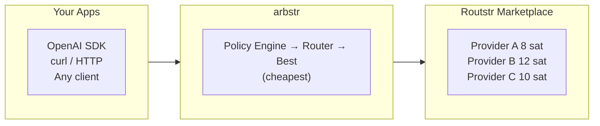

# arbstr

Intelligent LLM routing and cost arbitrage for the [Routstr](https://routstr.com) decentralized marketplace.

arbstr is a local proxy that sits between your applications and LLM providers on the Routstr marketplace. It automatically selects the cheapest provider for each request while respecting your quality and policy constraints.



Routstr is a decentralized LLM marketplace where multiple providers offer the same models at different rates (priced in satoshis). arbstr exploits these price spreads automatically.

## Features

- **OpenAI-compatible API** -- drop-in replacement proxy (`/v1/chat/completions`, `/v1/models`)
- **Multi-provider routing** -- automatically selects the cheapest available provider
- **Streaming observability** -- SSE stream interception extracts token counts and cost from streaming responses; trailing SSE event surfaces arbstr metadata (cost, latency) to clients
- **Policy engine** -- constrain routing by allowed models, max cost, and strategy
- **Keyword heuristics** -- automatic policy matching based on message content
- **Secret management** -- API keys protected by SecretString with zeroize-on-drop; never exposed in logs, debug output, or API responses
- **Environment variable expansion** -- use `${VAR}` syntax or omit `api_key` for convention-based `ARBSTR_<NAME>_API_KEY` auto-discovery
- **Config hygiene warnings** -- file permission checks, plaintext key warnings with actionable suggestions
- **Cost querying API** -- GET /v1/stats for aggregate cost/performance data with time range presets and model/provider filtering; GET /v1/requests for paginated request log browsing with sorting
- **Per-request correlation IDs** -- UUID tracing for every request through the system
- **Mock mode** -- test locally without real provider API calls

## Quick Start

```bash
# Clone and build
git clone https://github.com/johnzilla/arbstr.git
cd arbstr
cargo build --release

# Quick test with mock providers (no real API calls)
./target/release/arbstr serve --mock

# Or configure real providers
cp config.example.toml config.toml
# Edit config.toml with your Routstr providers
./target/release/arbstr serve
```

arbstr listens on `http://localhost:8080` by default. Point any OpenAI-compatible client at it:

```bash
curl http://localhost:8080/v1/chat/completions \
  -H "Content-Type: application/json" \
  -d '{
    "model": "gpt-4o",
    "messages": [{"role": "user", "content": "Hello!"}]
  }'
```

## Configuration

Copy `config.example.toml` to `config.toml` and customize:

```toml
[server]
listen = "127.0.0.1:8080"

# Providers -- rates in satoshis per 1000 tokens
[[providers]]
name = "provider-alpha"
url = "https://alpha.routstr.example/v1"
api_key = "${ALPHA_KEY}"       # env var reference (recommended)
models = ["gpt-4o", "claude-3.5-sonnet"]
input_rate = 10                # sats per 1k input tokens
output_rate = 30               # sats per 1k output tokens
base_fee = 1                   # per-request base fee in sats

[[providers]]
name = "provider-beta"
url = "https://beta.routstr.example/v1"
# api_key omitted -- arbstr auto-checks ARBSTR_PROVIDER_BETA_API_KEY
models = ["gpt-4o", "gpt-4o-mini"]
input_rate = 8
output_rate = 35

# Routing policies
[policies]
default_strategy = "cheapest"

[[policies.rules]]
name = "code_generation"
allowed_models = ["claude-3.5-sonnet", "gpt-4o"]
strategy = "lowest_cost"
max_sats_per_1k_output = 50
keywords = ["code", "function", "implement", "debug"]
```

See [`config.example.toml`](./config.example.toml) for a full annotated example.

### API Key Management

arbstr supports three ways to provide API keys, from most to least recommended:

1. **Convention-based** (recommended) -- omit `api_key` and set `ARBSTR_<UPPER_SNAKE_NAME>_API_KEY`:
   ```bash
   export ARBSTR_PROVIDER_ALPHA_API_KEY="cashuA..."
   ```

2. **Environment variable reference** -- use `${VAR}` syntax in config:
   ```toml
   api_key = "${MY_ROUTSTR_KEY}"
   ```

3. **Literal** (not recommended) -- plaintext in config file. arbstr will warn you:
   ```toml
   api_key = "cashuA..."  # triggers startup warning
   ```

The `check` command reports key status for each provider:
```bash
arbstr check -c config.toml
# Provider key status:
#   provider-alpha: key from convention (ARBSTR_PROVIDER_ALPHA_API_KEY)
#   provider-beta: no key (set ARBSTR_PROVIDER_BETA_API_KEY or add api_key to config)
```

### Policy Matching

Policies are matched in two ways:

1. **Explicit** -- set the `X-Arbstr-Policy` header on your request:
   ```bash
   curl http://localhost:8080/v1/chat/completions \
     -H "X-Arbstr-Policy: code_generation" \
     -H "Content-Type: application/json" \
     -d '{"model": "gpt-4o", "messages": [...]}'
   ```
2. **Heuristic** -- arbstr scans message content for keywords defined in each policy rule and picks the first match.

## How Routing Works

1. **Request arrives** at the arbstr proxy
2. **Policy matched** via `X-Arbstr-Policy` header or keyword heuristics
3. **Providers filtered** by policy constraints (allowed models, max cost)
4. **Cheapest selected** from remaining providers (considering output rate + base fee)
5. **Request forwarded** and response streamed back to the client

## CLI

```
arbstr serve [OPTIONS]          Start the proxy server
  -c, --config <PATH>           Config file path [default: config.toml]
  -l, --listen <ADDR>           Override listen address
      --mock                    Use mock providers (no real API calls)

arbstr check [OPTIONS]          Validate configuration
  -c, --config <PATH>           Config file path [default: config.toml]

arbstr providers [OPTIONS]      List configured providers
  -c, --config <PATH>           Config file path [default: config.toml]
```

## API Endpoints

| Endpoint | Description |
|----------|-------------|
| `POST /v1/chat/completions` | OpenAI-compatible chat completions (streaming and non-streaming) |
| `GET /v1/models` | List available models across all providers |
| `GET /v1/stats` | Aggregate cost/performance stats with time range and model/provider filtering |
| `GET /v1/stats?group_by=model` | Per-model stats breakdown |
| `GET /v1/requests` | Paginated request log listing with filtering and sorting |
| `GET /health` | Health check |
| `GET /providers` | List configured providers with rates |

## Development

```bash
cargo test                                    # Run tests
cargo run -- serve --mock                     # Run with mock providers
RUST_LOG=arbstr=debug cargo run -- serve --mock  # Debug logging
cargo run -- check -c config.toml             # Validate config
cargo fmt && cargo clippy -- -D warnings      # Format and lint
```

See [CLAUDE.md](./CLAUDE.md) for detailed development documentation including architecture, database schema, and testing strategy.

## Project Structure

```
src/
├── main.rs           # CLI entry point (serve, check, providers)
├── lib.rs            # Library root
├── config.rs         # Configuration, env var expansion, secret types
├── error.rs          # Error types (OpenAI-compatible responses)
├── proxy/
│   ├── server.rs     # axum server setup and middleware
│   ├── handlers.rs   # Request handlers (streaming + non-streaming)
│   ├── retry.rs      # Retry with backoff and provider fallback
│   ├── stream.rs     # SSE stream interception and usage extraction
│   ├── stats.rs      # Aggregate stats handler and time range resolution
│   ├── logs.rs       # Paginated request log handler with sorting
│   └── types.rs      # OpenAI-compatible request/response types
├── router/
│   └── selector.rs   # Provider selection and cost calculation
└── storage/
    ├── logging.rs    # SQLite request logging (async fire-and-forget)
    ├── stats.rs      # Aggregate stats queries (read-only pool)
    └── logs.rs       # Paginated log queries with dynamic filters
```

## Roadmap

| Version | Description | Status |
|---------|-------------|--------|
| **v1** | Reliability and observability -- retry with fallback, SQLite logging, response metadata headers, cost calculation | Shipped |
| **v1.1** | Secrets hardening -- SecretString API keys, env var expansion, convention-based key discovery, output surface hardening | Shipped |
| **v1.2** | Streaming observability -- SSE token extraction, post-stream DB updates, trailing cost events, stream duration tracking | Shipped |
| **v1.3** | Cost querying API -- aggregate stats, time range filtering, paginated request log listing with sorting | Shipped |

## Related Projects

- [Routstr](https://routstr.com) -- Decentralized LLM marketplace
- [routstr-core](https://github.com/Routstr/routstr-core) -- Core Routstr implementation

## Contributing

This project is being built in public. Issues and PRs welcome.

## License

Copyright (c) 2026 arbstr contributors

Licensed under the [MIT License](./LICENSE). You are free to use, modify, and distribute this software. See the LICENSE file for full terms.
