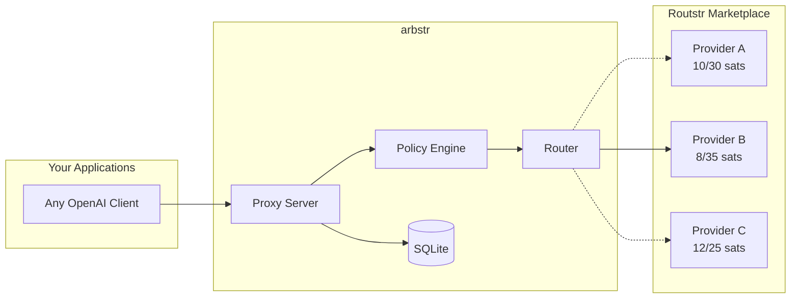
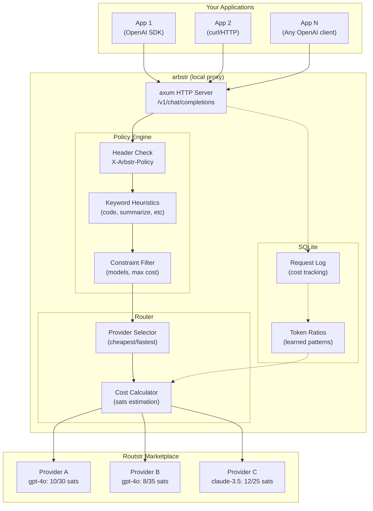

# arbstr

Intelligent LLM routing and cost arbitrage for the [Routstr](https://routstr.com) decentralized marketplace.

## What is this?

arbstr is a local proxy that sits between your applications and LLM providers on the Routstr marketplace. It automatically selects the cheapest provider for each request while respecting your quality constraints.



**Why?** Routstr is a decentralized LLM marketplace where multiple providers offer the same models at different rates. arbstr exploits these price spreads automatically.

## Features

### Current (MVP)
- [x] OpenAI-compatible API proxy (`/v1/chat/completions`, `/v1/models`)
- [x] Multi-provider routing (cheapest available)
- [x] Policy-based constraints (allowed models, max cost)
- [x] Keyword heuristics for automatic policy matching
- [ ] Request logging and cost tracking (SQLite)

### Planned
- [ ] Learned input/output token ratio prediction
- [ ] Temporal arbitrage (batch requests when BTC/USD favorable)
- [ ] Provider discovery via Nostr
- [ ] Quality monitoring and automatic escalation

## Quick Start

```bash
# Clone and build
git clone https://github.com/johnzilla/arbstr.git
cd arbstr
cargo build --release

# Quick test with mock providers (no real API calls)
./target/release/arbstr serve --mock

# Or configure real providers
cp config.example.toml config.toml
# Edit config.toml with your Routstr providers
./target/release/arbstr serve

# Point your apps to http://localhost:8080
# Use any OpenAI-compatible client
```

## Configuration

```toml
[server]
listen = "127.0.0.1:8080"

# Providers (manual config until Nostr discovery)
[[providers]]
name = "provider-alpha"
url = "https://alpha.routstr.example/v1"
# Rates in sats per 1000 tokens
input_rate = 10
output_rate = 30

[[providers]]
name = "provider-beta"
url = "https://beta.routstr.example/v1"
input_rate = 8
output_rate = 35

# Routing policies
[policies]
default = "cheapest"

[[policies.rules]]
name = "code_generation"
allowed_models = ["claude-3.5-sonnet", "gpt-4o", "deepseek-coder"]
strategy = "lowest_cost"
max_sats_per_1k_output = 50

[[policies.rules]]
name = "quick_tasks"
allowed_models = ["gpt-4o-mini", "claude-3-haiku"]
strategy = "lowest_latency"
```

## Usage

### Basic (cheapest available)

```bash
curl http://localhost:8080/v1/chat/completions \
  -H "Content-Type: application/json" \
  -d '{
    "model": "gpt-4o",
    "messages": [{"role": "user", "content": "Hello!"}]
  }'
```

### With explicit policy

```bash
curl http://localhost:8080/v1/chat/completions \
  -H "Content-Type: application/json" \
  -H "X-Arbstr-Policy: code_generation" \
  -d '{
    "model": "gpt-4o",
    "messages": [{"role": "user", "content": "Write a function..."}]
  }'
```

## How Routing Works



**Step by step:**

1. **Request arrives** at arbstr proxy
2. **Policy matched** via header or heuristics
3. **Providers filtered** by policy constraints (allowed models, max cost)
4. **Cheapest selected** from remaining providers
5. **Request forwarded** and response streamed back
6. **Metrics logged** for learning and cost tracking

## The Arbitrage Opportunity

| Type | Description | Status |
|------|-------------|--------|
| Cross-provider spread | Same model, different rates | MVP |
| Policy constraints | Quality bounds, not just cheapest | MVP |
| Input/output ratio | Predict costs, route verbose tasks to cheaper providers | Planned |
| Temporal | Batch when BTC/USD favorable | Planned |
| Quality-adjusted | Escalate if confidence low | Future |

## Project Structure

```
arbstr/
├── src/
│   ├── main.rs         # CLI (serve, check, providers)
│   ├── lib.rs          # Library exports
│   ├── config.rs       # TOML config parsing
│   ├── error.rs        # Error types
│   ├── proxy/          # HTTP server (axum)
│   │   ├── server.rs   # Server setup
│   │   ├── handlers.rs # Request handlers
│   │   └── types.rs    # OpenAI types
│   └── router/         # Provider selection
│       └── selector.rs # Routing logic
├── config.example.toml
├── CLAUDE.md           # Development guide
└── LICENSE             # MIT
```

## Development

```bash
# Run tests
cargo test

# Run with mock providers
cargo run -- serve --mock

# Run with debug logging
RUST_LOG=arbstr=debug cargo run -- serve --mock

# Validate config file
cargo run -- check -c config.toml

# List configured providers
cargo run -- providers -c config.toml

# Format and lint
cargo fmt && cargo clippy
```

See [CLAUDE.md](./CLAUDE.md) for detailed development documentation.

## Roadmap

**Phase 1: Foundation** ✅
- Basic proxy with single provider
- Multi-provider cheapest selection
- Policy constraints
- Keyword heuristics

**Phase 2: Intelligence** (current)
- Request logging and analytics
- Token ratio learning
- Cost tracking dashboard

**Phase 3: Advanced**
- Nostr provider discovery
- Temporal arbitrage
- Quality monitoring

## Related Projects

- [Routstr](https://routstr.com) - Decentralized LLM marketplace
- [routstr-core](https://github.com/Routstr/routstr-core) - Core Routstr implementation

## License

MIT

## Contributing

This project is being built in public. Issues and PRs welcome.
