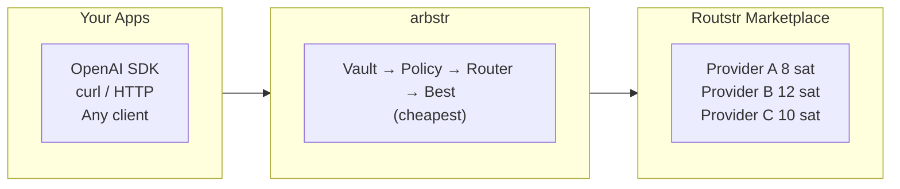

# arbstr

**NiceHash for AI inference** — an open marketplace for buying and selling AI compute, settled in Bitcoin.

arbstr routes AI inference requests to the cheapest qualified provider and settles payment in bitcoin over Lightning. It combines a Rust routing engine with a treasury service into a single deployable stack. Providers include [mesh-llm](https://docs.anarchai.org) nodes, Routstr endpoints, Ollama instances, or any OpenAI-compatible API. No tokens — just sats.


```mermaid
flowchart LR
    subgraph Apps["Your Apps"]
        direction TB
        A1["OpenAI SDK<br>curl / HTTP<br>Any client"]
    end

    subgraph Arbstr["arbstr"]
        direction TB
        B1["Vault → Policy → Router → Best<br>(cheapest)"]
    end

    subgraph Routstr["Routstr Marketplace"]
        direction TB
        C1["Provider A  8 sat<br>Provider B 12 sat<br>Provider C 10 sat"]
    end

    Apps --> Arbstr --> Routstr
```

Multiple providers offer the same models at different rates (priced in satoshis). arbstr exploits these price spreads automatically — free when your local GPU handles it, cheapest cloud provider when it can't.

## Features

- **OpenAI-compatible API** -- drop-in replacement proxy (`/v1/chat/completions`, `/v1/models`); unknown request fields forwarded unchanged
- **Multi-provider routing** -- selects the cheapest available provider per request
- **Auto-discovery** -- providers with `auto_discover = true` have their model lists populated from `/v1/models` at startup (mesh-llm, Ollama, any OpenAI-compatible endpoint)
- **Intelligent complexity routing** -- heuristic scorer routes simple requests to local/free providers, complex ones to frontier; automatic tier escalation on circuit break
- **Vault billing** -- per-request reserve/settle/release against arbstr vault; Bitcoin settlement via Lightning; fault-tolerant with pending settlement persistence
- **Circuit breakers** -- per-provider Closed/Open/Half-Open with automatic recovery probing
- **Streaming observability** -- SSE token extraction, trailing cost events, post-stream DB updates
- **Policy engine** -- constrain routing by allowed models, max cost, and strategy; keyword heuristics for auto-matching
- **Secret management** -- SecretString API keys with zeroize-on-drop; env var expansion; convention-based key discovery
- **Cost querying API** -- aggregate stats, time range filtering, paginated request logs
- **Docker Compose stack** -- full-stack deployment: core + vault + Lightning (LND) + Cashu mint
- **Mock mode** -- test locally without real provider API calls

## Quick Start

```bash
# Clone and build
git clone https://github.com/johnzilla/arbstr.git
cd arbstr
cargo build --release

# Quick test with mock providers (no real API calls)
./target/release/arbstr serve --mock

# Or configure real providers
cp config.example.toml config.toml
# Edit config.toml with your Routstr providers
./target/release/arbstr serve
```

arbstr listens on `http://localhost:8080` by default. Point any OpenAI-compatible client at it:

```bash
curl http://localhost:8080/v1/chat/completions \
  -H "Content-Type: application/json" \
  -d '{
    "model": "gpt-4o",
    "messages": [{"role": "user", "content": "Hello!"}]
  }'
```

## Configuration

Copy `config.example.toml` to `config.toml` and customize:

```toml
[server]
listen = "127.0.0.1:8080"
# rate_limit_rps = 100       # optional global rate limit (requests/sec)
# auth_token = "my-secret"   # optional bearer token for proxy endpoints

# Vault treasury integration (optional)
# When configured, requests require vault billing via reserve/settle/release.
# When absent, arbstr runs in free proxy mode (no billing).
# [vault]
# url = "http://localhost:3000"
# internal_token = "${VAULT_INTERNAL_TOKEN}"
# default_reserve_tokens = 4096   # max output tokens for reserve ceiling
# pending_threshold = 100         # max pending settlements before rejecting

# Providers -- rates in satoshis per 1000 tokens
# mesh-llm local inference (uncomment when mesh-llm is running)
# [[providers]]
# name = "mesh-local"
# url = "http://localhost:9337/v1"
# auto_discover = true         # polls /v1/models at startup
# tier = "local"
# input_rate = 0
# output_rate = 0

[[providers]]
name = "provider-alpha"
url = "https://alpha.routstr.example/v1"
api_key = "${ALPHA_KEY}"       # env var reference (recommended)
models = ["gpt-4o", "claude-3.5-sonnet"]
tier = "frontier"              # local | standard | frontier
input_rate = 10                # sats per 1k input tokens
output_rate = 30               # sats per 1k output tokens
base_fee = 1                   # per-request base fee in sats

[[providers]]
name = "provider-beta"
url = "https://beta.routstr.example/v1"
# api_key omitted -- arbstr auto-checks ARBSTR_PROVIDER_BETA_API_KEY
models = ["gpt-4o", "gpt-4o-mini"]
tier = "standard"
input_rate = 8
output_rate = 35

# Complexity routing (optional — controls tier selection thresholds)
# [routing]
# standard_threshold = 0.4    # score >= this → standard tier
# frontier_threshold = 0.7    # score >= this → frontier tier

# Routing policies
[policies]
default_strategy = "cheapest"

[[policies.rules]]
name = "code_generation"
allowed_models = ["claude-3.5-sonnet", "gpt-4o"]
strategy = "lowest_cost"
max_sats_per_1k_output = 50
keywords = ["code", "function", "implement", "debug"]
```

See [`config.example.toml`](./config.example.toml) for a full annotated example.

### API Key Management

arbstr supports three ways to provide API keys, from most to least recommended:

1. **Convention-based** (recommended) -- omit `api_key` and set `ARBSTR_<UPPER_SNAKE_NAME>_API_KEY`:
   ```bash
   export ARBSTR_PROVIDER_ALPHA_API_KEY="cashuA..."
   ```

2. **Environment variable reference** -- use `${VAR}` syntax in config:
   ```toml
   api_key = "${MY_ROUTSTR_KEY}"
   ```

3. **Literal** (not recommended) -- plaintext in config file. arbstr will warn you:
   ```toml
   api_key = "cashuA..."  # triggers startup warning
   ```

The `check` command reports key status for each provider:
```bash
arbstr check -c config.toml
# Provider key status:
#   provider-alpha: key from convention (ARBSTR_PROVIDER_ALPHA_API_KEY)
#   provider-beta: no key (set ARBSTR_PROVIDER_BETA_API_KEY or add api_key to config)
```

### Policy Matching

Policies are matched in two ways:

1. **Explicit** -- set the `X-Arbstr-Policy` header on your request:
   ```bash
   curl http://localhost:8080/v1/chat/completions \
     -H "X-Arbstr-Policy: code_generation" \
     -H "Content-Type: application/json" \
     -d '{"model": "gpt-4o", "messages": [...]}'
   ```
2. **Heuristic** -- arbstr scans message content for keywords defined in each policy rule and picks the first match.

## How Routing Works

1. **Request arrives** at the arbstr proxy
2. **Vault reserve** (if configured) -- reserves estimated cost from buyer's balance
3. **Policy matched** via `X-Arbstr-Policy` header or keyword heuristics
4. **Providers filtered** by policy constraints (allowed models, max cost)
5. **Cheapest selected** from remaining providers (considering output rate + base fee)
6. **Request forwarded** and response streamed back to the client
7. **Vault settle/release** -- settles actual cost on success, releases reservation on failure

## CLI

```
arbstr serve [OPTIONS]          Start the proxy server
  -c, --config <PATH>           Config file path [default: config.toml]
  -l, --listen <ADDR>           Override listen address
      --mock                    Use mock providers (no real API calls)

arbstr check [OPTIONS]          Validate configuration
  -c, --config <PATH>           Config file path [default: config.toml]

arbstr providers [OPTIONS]      List configured providers
  -c, --config <PATH>           Config file path [default: config.toml]
```

## API Endpoints

| Endpoint | Description |
|----------|-------------|
| `POST /v1/chat/completions` | OpenAI-compatible chat completions (streaming and non-streaming) |
| `GET /v1/models` | List available models across all providers |
| `GET /v1/stats` | Aggregate cost/performance stats with time range and model/provider filtering |
| `GET /v1/stats?group_by=model` | Per-model stats breakdown |
| `GET /v1/stats?group_by=tier` | Per-tier (local/standard/frontier) stats breakdown |
| `GET /v1/requests` | Paginated request log listing with filtering and sorting |
| `POST /v1/cost` | Estimate request cost before sending (input/output token counts and sats) |
| `GET /health` | Health check |
| `GET /providers` | List configured providers with rates |

## Development

See [DEVELOPMENT.md](./DEVELOPMENT.md) for the full development guide including architecture, database schema, and internals.

```bash
cargo test                    # Run all tests
cargo run -- serve --mock     # Run with mock providers
cargo fmt && cargo clippy -- -D warnings  # Format and lint
```

## Roadmap

| Version | Description | Status |
|---------|-------------|--------|
| **v1** | Reliability and observability -- retry with fallback, SQLite logging, response metadata | Shipped |
| **v1.1** | Secrets hardening -- SecretString API keys, env var expansion, key auto-discovery | Shipped |
| **v1.2** | Streaming observability -- SSE token extraction, trailing cost events, stream duration | Shipped |
| **v1.3** | Cost querying API -- aggregate stats, time range filtering, paginated request logs | Shipped |
| **v1.4** | Resilience -- circuit breakers, graceful shutdown, OpenAI field passthrough, multimodal | Shipped |
| **v1.5** | Hardening -- bounded DB writer, indexes, rate limiting, bearer token auth | Shipped |
| **v1.6** | Vault treasury -- reserve/settle/release billing, pending settlement reconciliation | Shipped |
| **v1.7** | Complexity routing -- tier system, heuristic scorer, tier-aware routing, escalation | Shipped |
| **v2.0** | Inference marketplace -- vault billing wiring, mesh-llm auto-discovery, Docker Compose deployment, arbstr.com landing page | Shipped |

## Deployment

### Standalone (free proxy mode)

```bash
cargo build --release
./target/release/arbstr serve -c config.toml
```

### Full stack (with billing)

Use [arbstr-node](https://github.com/johnzilla/arbstr-node) for the complete stack: core routing engine, vault treasury, Lightning (LND), and Cashu mint.

```bash
git clone https://github.com/johnzilla/arbstr-node && cd arbstr-node
cp .env.example .env   # fill in secrets
docker compose up
```

Your inference proxy is live at `http://localhost:8080`. See [arbstr.com](https://arbstr.com) for the full getting started guide.

## Related Projects

- [arbstr-node](https://github.com/johnzilla/arbstr-node) -- Full-stack deployment (core + vault + LND + Cashu mint)
- [arbstr-vault](https://github.com/johnzilla/arbstr-vault) -- Treasury service for Bitcoin settlement
- [mesh-llm](https://docs.anarchai.org) -- Distributed P2P inference network (local provider)
- [Routstr](https://routstr.com) -- Decentralized LLM marketplace

## Contributing

This project is being built in public. See [CONTRIBUTING.md](./CONTRIBUTING.md) for development setup and contribution guidelines.

## License

Copyright (c) 2026 arbstr contributors

Licensed under the [MIT License](./LICENSE). You are free to use, modify, and distribute this software. See the LICENSE file for full terms.
